# 20 MILLISECONDES

### *une image de Commodore 64, cycle par cycle*

Un livre qui apprend la puce graphique du Commodore 64 — le VIC-II — à quelqu'un qui **sait
programmer un peu**, dans n'importe quel langage, mais qui ne connaît **ni le C64, ni
l'assembleur**.

Toutes les vingt millisecondes, un C64 dessine une image complète : 312 lignes, 19 656
battements d'horloge. Le livre raconte ce qui se passe pendant **une seule** de ces images, en
zoomant chapitre après chapitre — la trame, la ligne, le cycle — jusqu'à faire faire à la
machine des choses que ses concepteurs n'avaient pas prévues.

📄 **[20-MILLISECONDES.pdf](20-MILLISECONDES.pdf)** — 65 pages · **[la source
markdown](20-MILLISECONDES.md)**

---

## Ce qui distingue ce livre

**Chaque image de ce livre est vraie.** Elle a été produite par le programme imprimé
juste au-dessus d'elle, assemblé et exécuté sur une machine réelle — un C64 Ultimate —, puis
capturée sur sa sortie vidéo. Aucune n'a été dessinée, simulée ou retouchée.

Et cette promesse est **vérifiée mécaniquement**, pas seulement affirmée :

| Contrôle | Résultat |
|---|---|
| Les 16 programmes imprimés s'assemblent et donnent le binaire officiel | **16 / 16**, au bit près |
| Chaque programme reproduit ce que le livre annonce, **mémoire entièrement salie avant le lancement** | **19 / 19** |
| Listings coupés par un saut de page (le copier-coller y survivrait mal) | **0** |

Le livre s'impose deux autres contraintes, qui font sa forme :

- **Treize instructions d'assembleur, pas une de plus**, du premier chapitre au FLI. Chacune
  arrive avec sa mini-fiche, au moment où elle sert.
- **Le rituel, à chaque chapitre** : une question qu'on peut voir à l'écran → un programme
  court → ce qu'on observe → l'explication. Jamais l'inverse.

---

## Ce que le lecteur fabrique en chemin

| | |
|---|---|
| 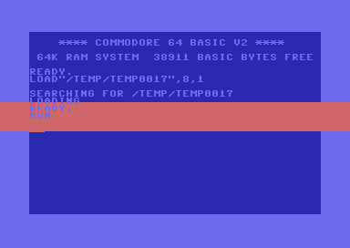 | **Chapitre 2** — une bande de couleur parfaitement immobile, obtenue en guettant le faisceau. Le C64 ne sait pas dessiner de rectangle : il connaît les instants. |
| 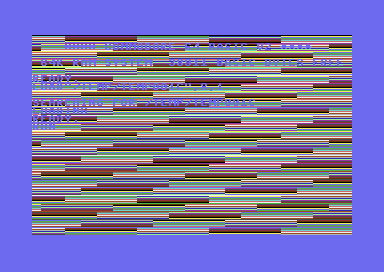 | **Chapitre 4** — un chronomètre à l'écran, où l'on voit le processeur se faire voler quarante cycles une ligne sur huit. Mesuré dans la capture : 0,29 changement de couleur contre 4 à 5 partout ailleurs. |
| 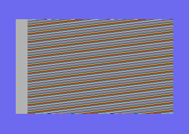 | **Chapitre 9** — le FLI : 192 lignes ayant chacune ses propres couleurs, là où la fiche technique en promet 24. Avec sa cicatrice de 24 pixels à gauche, que personne n'a jamais su effacer. |

---

## La structure du projet

```
20-millisecondes/
│
├── 20-MILLISECONDES.md        LE LIVRE — source unique de vérité (~3 100 lignes)
├── 20-MILLISECONDES.pdf       son rendu, fabriqué par tools/build_pdf.sh
├── README.md                  ce fichier
├── CLAUDE.md                  l'onboarding complet : objectif, règles, pièges, méthode
├── PAS-A-PAS-PLAN.md          le plan d'origine et les choix actés (titre, ACME, périmètre)
│
├── livre-pas-a-pas/           UN DOSSIER PAR CHAPITRE
│   ├── CAHIER-DES-CHARGES.md  le contrat imposé aux rédacteurs (rituel, budget, interdits)
│   ├── REPRODUCTIBILITE.md    le journal des essais sur matériel (19/19)
│   ├── ch00/ … ch10/          pour chacun : chapitre.md, les sources .a, les captures -hw.png
│   └── annexe/                les quatre pages de référence de fin de volume
│
├── tools/
│   ├── build_pdf.sh           markdown → LaTeX → PDF
│   ├── header.tex             toute la mise en forme (cadres de code, encadrés, en-têtes)
│   ├── titlepage.tex          la page de titre
│   ├── widths.lua             filtre pandoc : largeur des colonnes des tableaux
│   ├── shoot.sh               assembler → lancer sur le C64 Ultimate → capturer l'écran
│   ├── send.sh                envoi d'un .prg par l'API REST de la machine
│   ├── capture_stream.py      capture du vrai signal vidéo (flux UDP du VIC)
│   ├── scrub.a                salisseur de mémoire, pour prouver la reproductibilité
│   └── verifie.py             les cinq contrôles mécaniques du livre
│
└── reference/
    ├── AU-COEUR-DU-METAL.md            le volume de référence (version interne)
    ├── AU-COEUR-DU-METAL-C64-U64.md    son édition publique — celle que le livre cite
    ├── AU-COEUR-DU-METAL-C64-U64.pdf
    ├── tools-latex/                    la chaîne LaTeX de ces volumes (+ figures TikZ)
    └── sources/                        LE CORPUS : 14 documents d'origine (§ Sources)
```

Les `.prg` ne sont pas versionnés : ce sont des produits, `acme` les reconstruit à la demande.

---

## Les programmes

Dix-neuf sources assembleur, une par expérience. Toutes ont été assemblées avec **ACME**,
exécutées sur un **C64 Ultimate** et capturées. Les seize premières sont imprimées dans le
livre ; les trois dernières sont des variantes que le texte décrit sans les réimprimer.

| Chapitre | Source | Lignes | Ce qu'il fait |
|---|---|---|---|
| **0** | [`teaser.a`](livre-pas-a-pas/ch00/teaser.a) | 28 | La bande-annonce : des vagues de couleur ligne par ligne. Le lecteur ne la comprend pas encore — c'est la destination. |
| **1** | [`bordure.a`](livre-pas-a-pas/ch01/bordure.a) | 12 | Trois instructions : la bordure devient rouge, et le BASIC reprend la main. |
| **1** | [`stroboscope.a`](livre-pas-a-pas/ch01/stroboscope.a) | 9 | Noir, blanc, noir, blanc, le plus vite possible. On n'obtient pas un clignotement : des rayures. |
| **2** | [`bande.a`](livre-pas-a-pas/ch02/bande.a) | 19 | Guetter le faisceau pour poser une bande de couleur parfaitement immobile. |
| **3** | [`degrade.a`](livre-pas-a-pas/ch03/degrade.a) | 29 | La bande-annonce, réécrite et expliquée : une couleur prévue d'avance pour chaque ligne. |
| **4** | [`badline.a`](livre-pas-a-pas/ch04/badline.a) | 7 | Le chronomètre visuel : deux instructions qui rendent la Bad Line visible à l'œil nu. |
| **4** | [`eteint.a`](livre-pas-a-pas/ch04/eteint.a) | 9 | La contre-épreuve : écran éteint, plus aucune Bad Line, les stries redeviennent parfaites. |
| **4** | [`patience.a`](livre-pas-a-pas/ch04/patience.a) | 12 | Une attente calibrée : 20 cycles au lieu de 9, et l'escalier prédit apparaît (−24 px par ligne). |
| **4** | [`chrono.a`](livre-pas-a-pas/ch04/chrono.a) | 7 | *(variante non imprimée)* le même chronomètre, peint sur la bordure au lieu du fond. |
| **5** | [`matrice.a`](livre-pas-a-pas/ch05/matrice.a) | 29 | Écrire directement dans les mille casiers de l'écran — sans `PRINT`, sans le système. |
| **5** | [`demenage.a`](livre-pas-a-pas/ch05/demenage.a) | 31 | Bâtir une seconde matrice invisible, puis basculer l'écran dessus d'une seule écriture. |
| **6** | [`unsprite.a`](livre-pas-a-pas/ch06/unsprite.a) | 42 | Une créature de 24 × 21 pixels, dessinée en binaire, qui flotte au-dessus du texte. |
| **6** | [`huit.a`](livre-pas-a-pas/ch06/huit.a) | 82 | Les huit sprites en rang, huit couleurs, chaque valeur écrite à la main : rien n'est caché. |
| **6** | [`voleurs.a`](livre-pas-a-pas/ch06/voleurs.a) | 79 | Le chronomètre et les huit sprites ensemble : on *voit* les cycles qu'ils volent. |
| **7** | [`chute.a`](livre-pas-a-pas/ch07/chute.a) | 24 | FLD : empêcher la Bad Line, et tout l'écran tombe de quarante lignes. |
| **8** | [`sansbord.a`](livre-pas-a-pas/ch08/sansbord.a) | 57 | Esquiver les deux comparaisons de la bordure : elle n'a plus lieu, un sprite s'y promène. |
| **8** | [`fantome.a`](livre-pas-a-pas/ch08/fantome.a) | 57 | *(variante décrite)* la même chose, avec l'octet fantôme forcé, pour montrer ce que le VIC y lit. |
| **9** | [`fli.a`](livre-pas-a-pas/ch09/fli.a) | 38 | Le FLI : une Bad Line provoquée à chaque ligne, 192 lignes de couleurs libres. |
| **9** | [`flirate.a`](livre-pas-a-pas/ch09/flirate.a) | 53 | *(l'échec, gardé exprès)* la boucle à compteur, juste au cycle près, qui casse quand même. |

Chaque source est autonome : elle contient son amorce BASIC, ses données et son code. Aucune
ne dépend de ce qu'un autre programme aurait laissé en mémoire — c'est mesuré, salisseur à
l'appui.

---

## La galerie

Les dix-huit écrans du livre, tous capturés sur la sortie vidéo d'une machine réelle.

| | | |
|---|---|---|
| 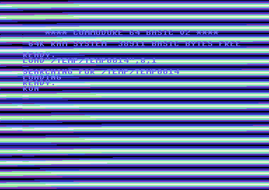<br>**0** · la bande-annonce | 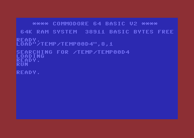<br>**1** · bordure rouge | 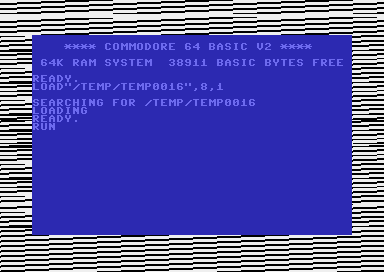<br>**1** · le stroboscope |
| <br>**2** · la bande immobile | 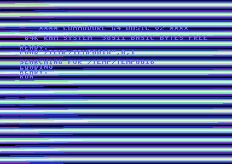<br>**3** · une couleur par ligne | <br>**4** · la Bad Line, visible |
| 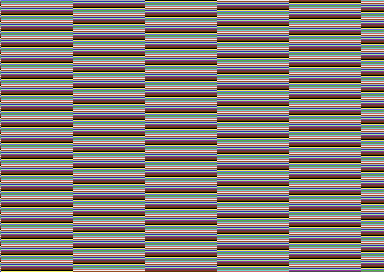<br>**4** · écran éteint, plus de vol | 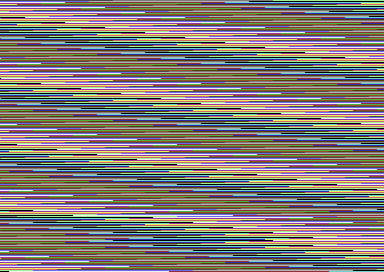<br>**4** · l'escalier à −24 px | 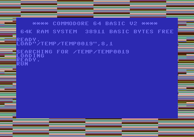<br>**4** · le chronomètre en bordure |
| 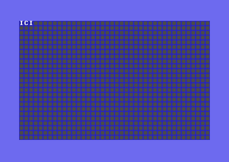<br>**5** · écrire dans l'écran | 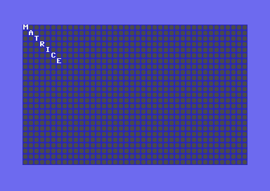<br>**5** · l'écran déménage | 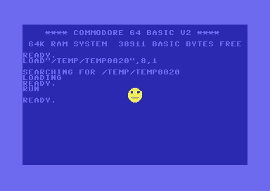<br>**6** · une créature |
| 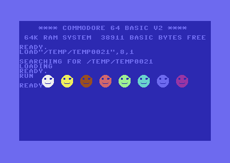<br>**6** · les huit en rang | 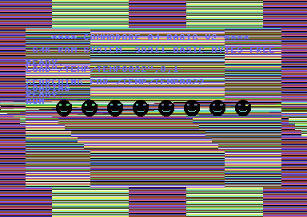<br>**6** · les huit voleurs | 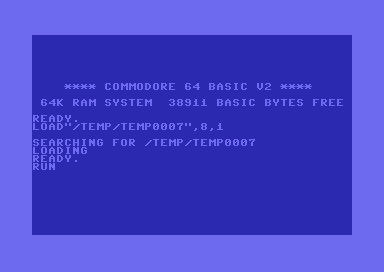<br>**7** · l'écran tombe |
| 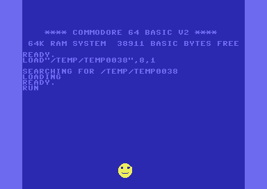<br>**8** · plus de bordure | 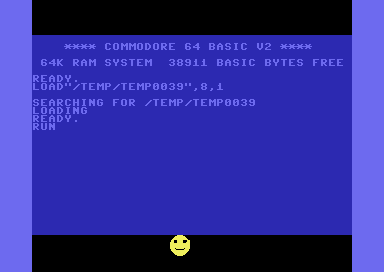<br>**8** · l'octet fantôme | 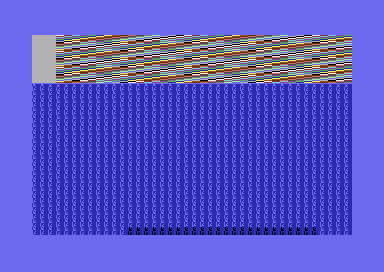<br>**9** · l'échec, à 48 lignes |
| <br>**9** · le FLI, 192 lignes | | |

---

## Sommaire

| | |
|---|---|
| **0** | La machine vue de haut |
| **1** | Kit de survie 6502 |
| **2** | La trame : voir le temps |
| **3** | La ligne : 63 battements |
| **4** | La Bad Line : quand l'artiste réquisitionne le couloir |
| **5** | Les cellules : d'où viennent les caractères |
| **6** | Les sprites : huit objets libres |
| **7** | Les compteurs cachés, et l'écran qui tombe |
| **8** | Ouvrir la bordure |
| **9** | Le grand final : toutes les couleurs à la fois |
| **10** | La même machine en 2026 |
| | *Annexe : quatre pages à garder sous la main · Sources* |

---

## Le volume compagnon : « Au cœur du métal »

**[Au cœur du métal — Commodore 64 & Ultimate 64](reference/AU-COEUR-DU-METAL-C64-U64.pdf)**
est la référence dont ce livre est le guide de visite. Chaque encadré « Sous le capot » y
renvoie, par chapitre et par section.

Les deux n'ont pas le même métier, et c'est voulu :

|  | **Au cœur du métal** | **20 millisecondes** |
|---|---|---|
| ce qu'il fait | **atteste** la règle | **montre** le phénomène |
| comment on le lit | on le consulte | on le suit du début à la fin |
| ce qu'il suppose | qu'on sait déjà | qu'on ne sait rien |

Il **n'est pas une source primaire** : il a été écrit *à partir* des documents d'origine
(l'article de Christian Bauer, les chronogrammes de Marko Mäkelä, les tables de cycles du
6510…), qu'il rassemble, recoupe et traduit, en ancrant chaque affirmation sur celui qui
l'atteste. Et il **n'a aucune vocation pédagogique**, ce qu'il assume : il énonce, il
n'explique pas. Un débutant s'y noierait dès la troisième page.

**C'est l'aîné des deux, et c'est de sa lecture que ce livre est né** : tout y était juste, et
personne ne pouvait l'apprendre.

Le dossier [`reference/`](reference/) contient les deux volumes, leur chaîne LaTeX, et le
[corpus des sources primaires](reference/sources/) sur lequel tout repose.

---

## Fabriquer, exécuter, vérifier

```bash
./tools/build_pdf.sh                            # markdown → LaTeX → PDF
./tools/shoot.sh livre-pas-a-pas/ch04/badline.a # assembler, lancer sur le C64 Ultimate,
                                                #   et capturer ce qu'il affiche vraiment
python3 tools/verifie.py                        # les cinq contrôles mécaniques
```

**Prérequis** : [ACME](https://sourceforge.net/projects/acme-crossass/) 0.95 ou plus récent,
`pandoc` + `xelatex`, `python3` avec Pillow. Pour les captures : un C64 Ultimate joignable sur
le réseau (variable `C64U_IP`).

Chaque chapitre a son dossier dans [`livre-pas-a-pas/`](livre-pas-a-pas/) : les sources
assembleur, les captures, et de quoi tout rejouer. Le protocole de l'essai de reproductibilité
— salir toute la mémoire, puis vérifier que chaque programme tient encore sa promesse — est
consigné dans [REPRODUCTIBILITE.md](livre-pas-a-pas/REPRODUCTIBILITE.md).

---

## Comment ce livre a été fait

Rédigé par une intelligence artificielle (Claude) sous la direction de **Johnny Piette**, puis
audité par trois regards complémentaires : un vérificateur de faits confrontant chaque chiffre
aux sources, un lecteur jouant le **débutant total** (« à quelle page décroches-tu ? »), et un
lecteur jouant le **dactylo**, qui ne possède que le livre imprimé et tape ce qu'il voit.

Chacun a trouvé ce que les autres ne pouvaient pas voir : un sprite pointant vers un dessin
jamais écrit, deux chapitres qui se contredisaient, un bloc de code jamais refermé. Le
détail de ces passes, et les corrections qui en sont sorties, est dans
[CLAUDE.md](CLAUDE.md) — c'est aussi le document à lire pour reprendre le travail.

---

*Juillet 2026 — pour le Commodore 64, quarante-quatre ans après.*
